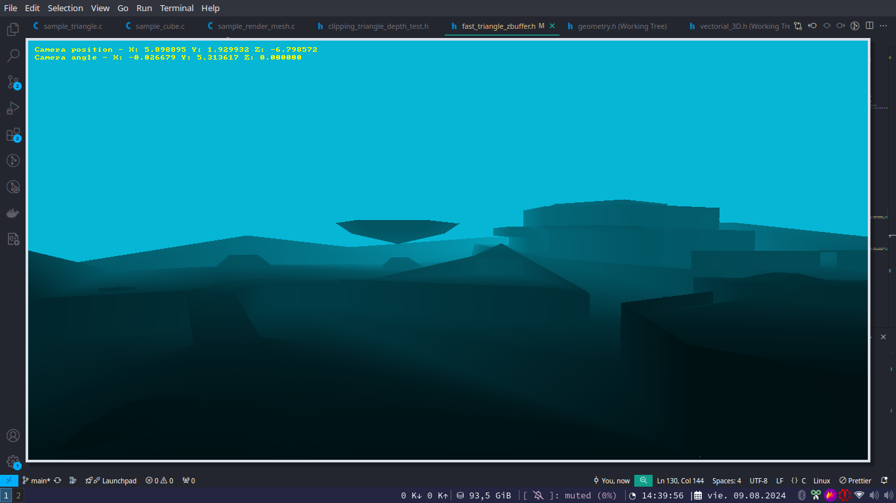

# GUB Game Engine



This project is a basic graphics engine using SDL (Simple DirectMedia Layer) 1.2. It demonstrates how to create a simple game loop, handle screen updates, and manage threads for rendering.

- **`include/graphic_engine.h`**: Header file containing definitions, global variables, and functions for initializing and managing the graphics engine.
- **`src/sample.c`**: Main source file containing the game loop and circle drawing functionality.
- **`screenshots/image.png`**: Directory for storing screenshots or images related to the project.

## Features

- Initializes SDL and sets up a graphical window.
- Creates a game loop that updates the screen at approximately 60 FPS.
- Draws a circle on the screen.

## Dependencies

- SDL 1.2
- GCC (GNU Compiler Collection)

## Installation and Setup

### On Windows

1. **Install SDL 1.2:**
   - Download the SDL 1.2 development libraries from the [SDL website](https://www.libsdl.org/download-1.2.php).
   - Extract the contents and place the `include` and `lib` directories in a known location.

2. **Set Up Your Development Environment:**
   - Install MinGW or MinGW-w64:
     - **MinGW32**: A port of GCC for Windows, available from [MinGW's website](http://www.mingw.org/).
     - **MinGW-w64**: An alternative to MinGW32 that supports both 32-bit and 64-bit Windows. Available from [MinGW-w64's website](https://mingw-w64.org/doku.php/download).

   - Ensure the SDL include and lib paths are correctly set up in your development environment or makefile.

3. **Compile the Project:**

   Open a Command Prompt and navigate to the `src` directory. Then, run the following command to compile the project:

   - Using **MinGW32**:

     ```sh
     gcc -o basic_sdl_graphic_engine src/sample.c -I/path/to/SDL/include -L/path/to/SDL/lib -lSDL
     ```

   - Using **MinGW-w64**:

     ```sh
     x86_64-w64-mingw32-gcc -o basic_sdl_graphic_engine src/sample.c -I/path/to/SDL/include -L/path/to/SDL/lib -lSDL
     ```

   Replace `/path/to/SDL/include` and `/path/to/SDL/lib` with the actual paths to the SDL 1.2 include and library directories.

4. **Run the Project:**

   ```sh
   basic_sdl_graphic_engine.exe
   ```

### On Linux

1. **Install SDL 1.2:**

   - **Debian-based Systems (e.g., Ubuntu):**

     ```sh
     sudo apt-get update
     sudo apt-get install libsdl1.2-dev
     ```

   - **Red Hat-based Systems (e.g., Fedora):**

     ```sh
     sudo dnf install SDL-devel
     ```

   - **Arch Linux:**

     ```sh
     sudo pacman -S sdl
     ```

     Arch Linux uses `pacman` as the package manager. The package `sdl` in the Arch repositories includes SDL 1.2 development files.

2. **Compile the Project:**

   Open a terminal and navigate to the `src` directory. Run the following command to compile the project:

   ```sh
   gcc -o basic_sdl_graphic_engine sample.c `sdl-config --cflags --libs`
   ```

   The `sdl-config` script provides the necessary compiler and linker flags for SDL.

3. **Run the Project:**

   ```sh
   ./basic_sdl_graphic_engine
   ```

## Usage

1. **Build the Project:**
   - Follow the instructions for your operating system to compile the project.

2. **Run the Engine:**
   - Execute the compiled binary. A window should appear with a 512x512 resolution and a title "Basic SDL Graphic Engine". The screen will display a red circle with a radius of 64 pixels at the center.

## Code Overview

### `include/graphic_engine.h`

Contains definitions and declarations for managing the graphics engine, including:
- **EngineInstance**: Structure for storing SDL surface and thread information.
- **Global Variables**: For screen dimensions, framebuffer, and global instance.
- **Functions**: For initializing the screen, setting the window title, managing the game loop, handling events, and drawing pixels.

## Troubleshooting

- **SDL Initialization Issues:** Ensure SDL is correctly installed and linked. Verify the paths to the SDL libraries and include files.
- **Compilation Errors:** Check that GCC and SDL are properly installed and configured. Ensure all dependencies are resolved.
